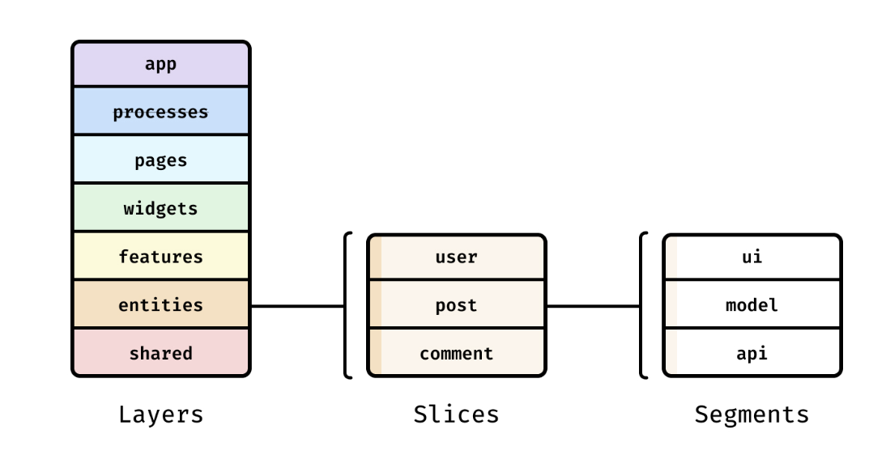

# FSD
FSD는 Feature-Sliced Design으로 코드 구성에 대한 규칙과 관례를 모아놓은 것입니다.

## FSD의 주요 목적
FSD의 주요 목적은 끊임없이 변화하는 비즈니스 요구 사항에 맞춰 프로젝트를 더욱 이해하기 쉽고 안정적으로 만드는 것입니다.

- `app`
  - `routes`
  - `analytics`
- `pages`
  - `home`
  - `artcle-reader`
    - `ui`
    - `api`
  - `settings`
- `shared`
  - `ui`
  - `api`

이 폴더들 중 `app`, `pages`, `shared`와 같은 이러한 최상위 폴더를 **layers** 라고 합니다.

이러한 layers 폴더 안에 있는 `routes`, `home`, `api` 등 과 같은 폴더들을 **slices** 라고 합니다.

slices는 레이어를 도메일 별로 나눕니다.

`app`, `shared`, 및 내부의 폴더를 세그먼트`pages/article-reader`라고 하며, 세그먼트는 기술적 목적, 즉 코드의 용도에 따라 슬라이스(또는 레이어)를 나눕니다.

## 개념
레이어, 슬라이스, 세그먼트는 다음과 같은 계층 구조를 형성합니다.

모든 FSD 프로젝트에서 layers는 표준화되어 있습니다.
모든 레이어를 사용할 필요는 없지만, 레이어 이름은 중요합니다.

1. **app** - 앱을 실행하기 위한 모든 요소
2. **pages** - 중첩 라우팅의 전체 페이지 또는 페이지의 큰 부분입니다.
3. **widgets** - 일반적으로 전체 사용 사례를 제공하는 기능이나 UI의 대규모 자체 포함 청크입니다.
4. **features** - 전체 제품 기능의 재사용된 구현, 즉 사용자에게 비즈니스 가치를 제공하는 작업니다.
5. **entities** - 프로젝트를 다루는 비즈니스 개체들을 말하며, 예를 들어 사용자(user) 또는 상품(product) 같은 것들입니다.
6. **shared** - 재사용 가능한 기능으로, 특히 프로젝트/사업의 세부 사항과 분리되어 있을 때 유용하지만 반드시 그런 것은 아닙니다.
  
여기서 `app` 및 `shared` leyer는 다른 레이어와 달리 슬라이스가 없고 세그먼트로 직접 나뉩니다.
 
그러나 `entities`, `features`, `widgets` 및 `pages`와 같은 다른 모든 계층은 슬라이스를 만들고 그 안에 세그먼트를 만드는 구조를 유지합니다.

 
레이어의 핵심은 한 레이어의 모듈은 바로 아래 레이어의 모듈만 알 수 있고, 해당 레이어에서 가져올 수 있다는 것입니다.

### Slices
슬라이스의 이름은 자유롭게 정할 수 있으며, 원하는 만큼 만들 수 있습니다.
슬라이스는 논리적으로 관련된 모듈을 서로 가깝게 유지하여 코드베이스를 더 쉽게 탐색할 수 있도록 합니다.

슬라이스는 동일 레이어에 있는 다른 슬라이스를 사용할 수 없으므로 높은 응집력과 낮은 결합도를 달성하는데 도움이 됩니다.

### Segments
세그먼트는 코드를 용도별로 그룹화 합니다.
세그먼트 이름은 표준에 의해 제한되지 않지만, 가장 일반적인 용도에 맞는 몇 가지 일반적 이름이 있습니다.

- **ui** - UI 표시와 관련된 모든 것
- **API** - 백엔드 상호작용
- **model** - 데이터 모델
- **lib** - 이 슬라이스의 다른 모듈에 필요한 라이브러리 코드
- **config** - 구성 파일 및 기능 플래그

일반적으로 이러한 세그먼트는 대부분의 레이어에 충분하며, 공유 또는 앱에서만 세그먼트를 직접 만들 수 있지만 이는 규칙이 아닙니다.

## FSD 장점
- 균일성 - 구조가 표준화되어 있으므로 프로젝트가 더 균열해진다.
- 변경 및 리팩토링 시 안정성 확보 - 한 계층의 모듈

